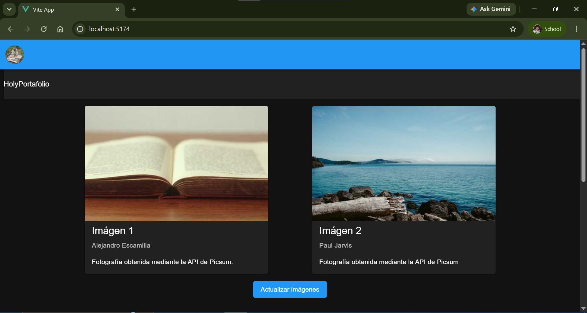
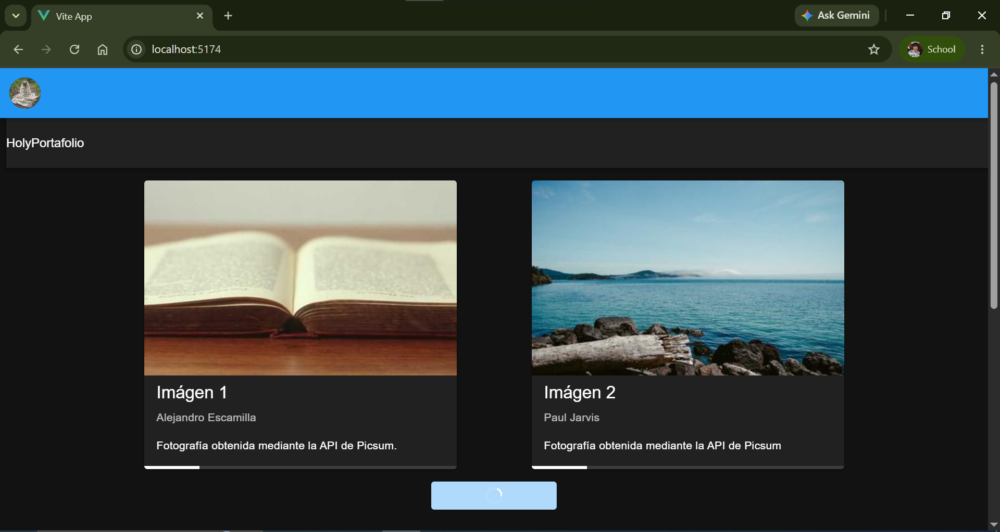
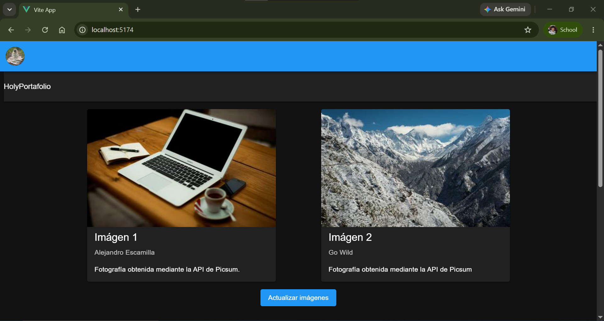
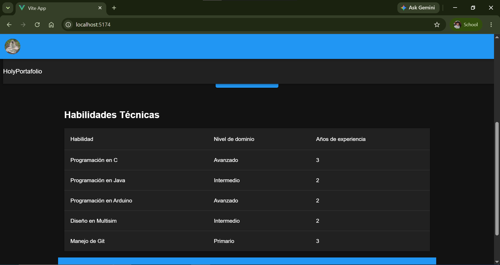
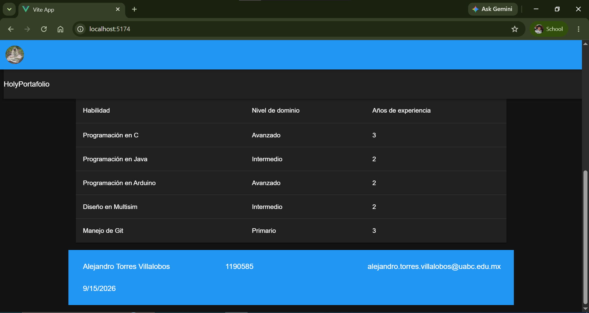

# Meta 2.1 - Interfaz de usuario con Vuetify

El presente proyecto presenta una aplicación de una sola página en la que el usuario puede actualizar dos imágenes aleatorias extraidas de una API. El usuario puede también consultar información referente al desarrollador de la página.

## Componentes

### HolyCard.vue

Es un componente reutilizable que permite mostrar información de una imagen dentro de una tarjeta.

El componente recibe a través de sus propiedades la información que debe mostrar.

<h3><wbr>

| Propiedad   | Tipo   | Requerida | Descripción                                        |
| ----------- | ------ | --------- | --------------------------------------------------- |
| imagen      | String | Sí       | URL o dirección de la imagen                       |
| titulo      | String | Sí       | Título o nombre de la imagen                       |
| descripcion | String | Sí       | Texto descriptivo de la imagen                      |
| autor       | String | Sí       | Nombre del autor de la imagen                       |
| cargando    | String | Sí       | Indicador de si la imagen esta lista para mostrarse |

### HolyFooter.vue

Es un componente reutilizable que permite mostrar información de un estudiante dentro de un pie de página.

El componente tiene definida información predeterminada por defecto en cada uno de sus propiedades, aunque esta información puede ser modificada a través de las mismas.

| Propiedad | Tipo   | Requerida | Descripción                            | Valor por defecto                       |
| --------- | ------ | --------- | --------------------------------------- | --------------------------------------- |
| nombre    | String | Sí       | Nombre completo del estudiante          | Alejandro Torres Villalobos             |
| matricula | String | Sí       | Matricula institucional del estudiante  | 1190585                                 |
| contacto  | String | Sí       | Información de contacto del estudiante | alejandro.torres.villalobos@uabc.edu.mx |

### HolyHeader.vue

Es un componente reutilizable que permite personalizar la cabecera de la aplicación web.

El componente tiene definidos valores predeterminados por defecto para los elementos a mostrar en la cabecera en cada una de sus propiedades, aunque esta información puede ser modificada a través de las mismas.

| Propiedad | Tipo   | Requerida | Descripción                                                     | Valor por defecto                     |
| --------- | ------ | --------- | ---------------------------------------------------------------- | ------------------------------------- |
| logo      | String | Sí       | URL o dirección de la imagen para el logo de la aplicación web | https://picsum.photos/id/1025/100/100 |
| titulo    | String | Sí       | Nombre de la aplicación web                                     | HolyPortafolio                        |

### HolyTabla.vue

Es un componente reutilizable que permite desplegar una tabla con las habilidades técnicas del estudiante.

El componente contiene un vector con las diferentes habilidades del estudiante, así como el nível y los años de experiencia para cada una de ellas.

Este vector es una constante y su contenido no puede ser modificado.

## Aplicación

### Instalación y Ejecución

Para instalar correctamente el proyecto primero se debe de clonar directamente desde el repositorio de github.

```Shell
git clone https://github.com/alexTorres2240/web-meta-2.1.git
```

Después hay que entrar a la carpeta del proyecto.

```Shell
cd web-meta-2.1
```

Después hay que instalar las dependencias necesarias para el correcto funcionamiento de la aplicación.

```Shell
npm install
```

Por último hay que ejecutar la aplicación en la raíz del proyecto.

```Shell
npm run dev
```

### Uso

Al entrar a la aplicación se despliega la cabecera en la parte superior, y debajo de ella dos tarjetas de imágenes, una a lado de la otra, con una imágen diferente cada una, obtenidas aleatoriamente a través de la API.



También se puede encontrar debajo de las dos tarjetas un botón con el que el usuario puede interactuar para así cambiar el contenido de las tarjetas, cambiando las imágenes e información de cada una.



Más abajo en la página, se encuentra también la tabla de habilidades del estudiante, así como el pie de la página justo al final de la misma.


